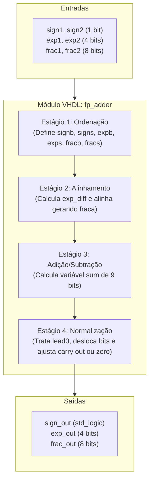
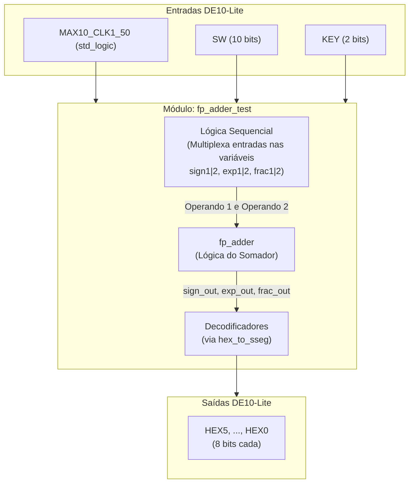
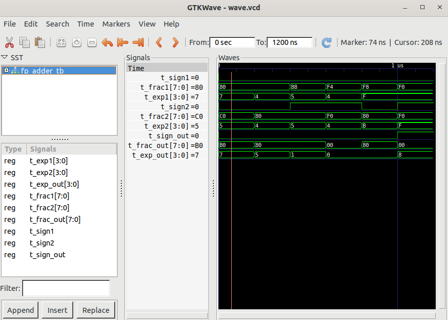
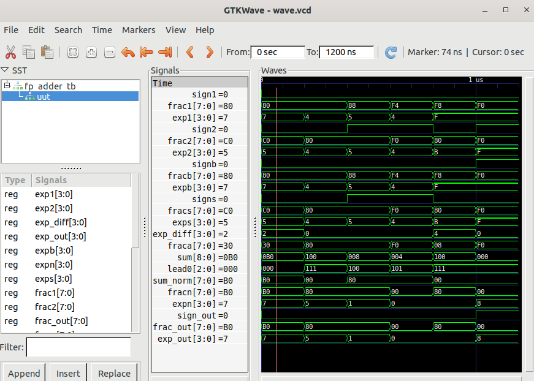
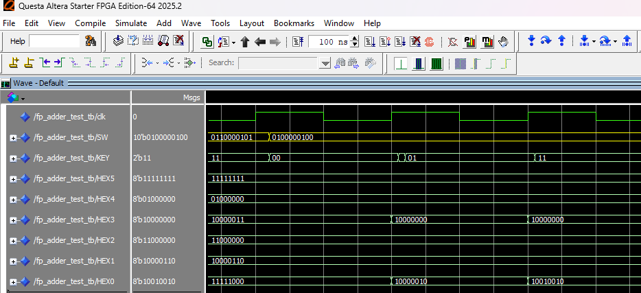
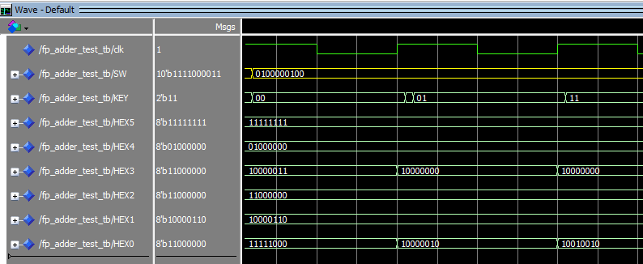
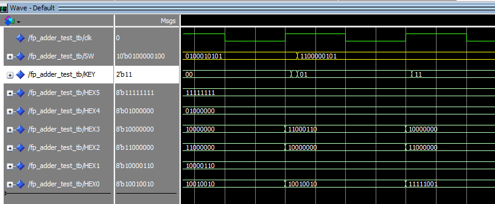
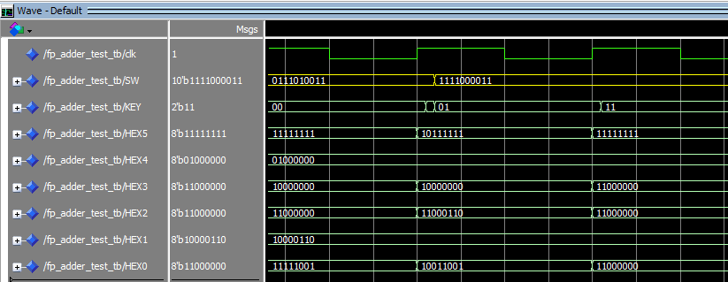

# Tutorial: Implementação de Somador Ponto Flutuante na DE10-Lite

**Autores:** Daniel Medici Martins, Gabriel Ângelo Sembenelli, 	Vinicius Higuchi

**Disciplina:** Sistemas Digitais Q2.20026

**Data:** 9 de Agosto de 2026

---

*Etapa 1*

## 1. Objetivo do Projeto

Este projeto adapta o somador de ponto flutuante simplificado (13 bits) do livro-texto para a placa Terasic DE10-Lite (MAX 10). O objetivo é demonstrar a síntese lógica e a simulação de hardware usando VHDL.

## 2. Descrição gráfica do funcionamento do sistema

A parte lógica do somador (`fp_adder.vhd`) recebe dois números em formato de ponto flutuante $(-1)^s \times 0.f \times 2^e$, onde $s$ corresponde ao sinal, $f$ corresponde à parte fracionária (ou significando) e $e$ corresponde ao expoente.
O funcionamento da soma é em 4 estágios:

* **1. Ordenação:** Identifica o maior (big) e o menor (small) número, desconsiderando o sinal.

* **2. Alinhamento:** Calcula a diferença entre os expoentes (`exp_diff = expb - exps`) e desloca o significando do menor número (`fracs`) para a direita, de modo a deixar os expoentes iguais.

* **3. Adição/Subtração:** Realiza a soma ou subtração dos significandos a depender dos sinais (soma quando iguais e subtrai caso contrário), originando a variável `sum` que inclui um bit extra para *carry-out*.

* **4. Normalização:** Conta a quantidade de zeros à esquerda do significando (`lead0`) e faz a normalização com condições especiais: Se houve carry out ($1.f \times 2^e$), então o número resultante é deslocado para a direita ($0.1f \times 2^(e+1)$); Se o número é pequeno demais para normalizar, então o resultado é definido como zero; Em condições normais, o significando é deslocado `lead0` casas para a esquerda e o expoente também é ajustado de acordo.

O resultado após a normalização é encaminhado para as saídas e o sinal resultante é o mesmo do maior número (big).

As variáveis usadas ao longo do código do somador (`fp_adder.vhd`) são:

- `sign1`|`2`, `frac1`|`2`, `exp1`|`2` são as entradas (sinal, significando e expoente) do primeiro e segundo número, respectivamente;
- `signb`|`s`, `fracb`|`s`, `expb`|`s` são os valores (sinal, significando e expoente) dos números big e small, respectivamente;
- `exp_diff` é a diferença de expoentes (`expb` - `exps`)
- `fraca` é o significando do menor número alinhado
- `sum` é o resultado da soma (ou subtração, a depender dos sinais) de `fracb` e `fraca`
- `lead0` é a quantidade de zeros à esquerda em `sum`
- `sum_norm` é `sum` normalizado de acordo com `lead0`
- `fracn` é a parte fracionária após normalização com condições especiais
- `expn` é o expoente após normalização com condições especiais
- `sign_out`, `frac_out`, `exp_out` são os valores (sinal, significando e expoente) do resultado final

O diagrama a seguir ilustra o fluxo e as respectivas variáveis VHDL da entidade:



*Etapa 2*

## 3. Adaptações de Hardware (DE10-Lite)

A arquitetura original utilizava 8 switches, 4 botões e 4 displays de sete segmentos. O respectivo código, em `code/old/fp_adder_test.vhd`, fixava o sinal (`0`) e expoente (`1000`) do primeiro número, além de fixar alguns bits de ambos significandos. Além disso, era utilizado um módulo de multiplexação no tempo (`disp_mux.vhd`) para exibir o resultado nos displays.

**O que mudamos no VHDL original:**

* Removemos o módulo `disp_mux.vhd`, pois a placa DE10-Lite permite exibição simultânea.
* Reorganizamos a lógica para entrar com os números usando uma lógica sequencial. A placa DE10-Lite possui 10 switches (`SW`) e 2 botões (`KEY`). Assim, o primeiro switch seleciona o sinal, os próximos 5 switches selecionam os 5 bits mais à esquerda do significando (os últimos 3 bits são fixados em zero) e os últimos 4 switches selecionam o expoente. Os dois botões se combinam para salvar a entrada atual como primeiro ou segundo número (um botão como seletor e um botão para salvar, enquanto um clock captura seus sinais).
* Roteamos as saídas do resultado diretamente para os 6 displays independentes da placa, `HEX5` a `HEX0`, sem multiplexação. `HEX5` para sinal, `HEX4` fixo em "0.", `HEX3` e `HEX2` para os 4 bits mais significativos e menos significativos da parte fracionária, respectivamente; `HEX1` fixo em "E", como abreviação de "vezes 2 elevado a"; `HEX0` para o expoente.
* Reorganizamos as strings correspondentes aos sete segmentos no arquivo `hex_to_sseg.vhd`, invertendo-as para compatibilidade com a DE10-Lite.

> Obs.: Os códigos antigos foram mantidos em `code/old` para efeitos de comparação.

**Descrição gráfica do sistema**

O diagrama abaixo reflete a integração atual (`fp_adder_test`), evidenciando a multiplexação nas entradas e o roteamento direto para os displays:



## 4. Evidências de Validação

### Simulação

Neste Repositório, utilizamos os seguintes arquivos para a simulação (`fp_adder_test.vhd`; `fp_adder.vhd`; `hex_to_sseg.vhd`) teste (`fp_adder_test_testbench.vht`) e configuração (`DE10_LITE.qsf`).

Para investigar o 4º estágio (normalização) na simulação, consideramos as quatro situações possíveis:

* **Teste 1:** Soma sem casos especiais na normalização

Esse teste é uma soma comum e não cai em nenhum caso especial na normalização.

```txt
base 10 |         base 2           | base 16 (gtkwave)
  +64   |   +0.1000 0000 * 2^0111  | (s,f,e) = (0, 80, 7)
  +24   |   +0.1100 0000 * 2^0101  | (s,f,e) = (0, C0, 5)
========= Alinhando o menor número ======================
  +64   |   +0.1000 0000 * 2^0111  | 
  +24   |   +0.0011 0000 * 2^0111  | 
  ———   |   —————————————————————  | ————————————————————
= +88   | = +0.1011 0000 * 2^0111  | (s,f,e) = (0, B0, 7)
```

* **Teste 2:** Soma com carry out

Essa soma gera um carry out, ou seja, o número 1 à esquerda do ponto flutuante, sendo necessário um deslocamento à direita.

```txt
base 10 |         base 2           | base 16 (gtkwave)
   +8   |   +0.1000 0000 * 2^0100  | (s,f,e) = (0, 80, 4)
   +8   |   +0.1000 0000 * 2^0100  | (s,f,e) = (0, 80, 4)
  ———   |   —————————————————————  | 
= +16   | = +1.0000 0000 * 2^0100  | 
===== Deslocamento à direita na normalização ============
= +16   | = +0.1000 0000 * 2^0101  | (s,f,e) = (0, 80, 5)
```

* **Teste 3:** Subtração com deslocamento à esquerda

Esse cálculo gera 4 zeros à esquerda no resultado, sendo necessário um deslocamento à esquerda.

```txt
base 10 |         base 2           | base 16 (gtkwave)
  +17   |   +0.1000 1000 * 2^0101  | (s,f,e) = (0, 88, 5)
  -16   |   -0.1000 0000 * 2^0101  | (s,f,e) = (1, 80, 5)
  ———   |   —————————————————————  | 
=  +1   | = +0.0000 1000 * 2^0101  | 
===== Deslocamento à esquerda na normalização ===========
=  +1   | = +0.1000 0000 * 2^0001  | (s,f,e) = (0, 80, 1)
```

* **Teste 4:** Subtração com resultado pequeno demais é zerado na normalização

Esse caso dá um número pequeno demais, ou seja, um número em que a quantidade de zeros à esquerda (`lead0`) é maior que o valor do expoente. Neste projeto, como a representação do expoente não admite número negativo, o livro opta por zerar o resultado na normalização.

```txt
base 10 |         base 2           | base 16 (gtkwave)
  +7.25 |   +0.1110 1000 * 2^0011  | (s,f,e) = (0, E8, 3)
  -7.00 |   -0.1110 0000 * 2^0011  | (s,f,e) = (1, E0, 3)
  ————— |   —————————————————————  | 
= +0.25 | = +0.0000 1000 * 2^0011  | 
=== Normalização zera o resultado (lead0 > expoente) ====
=  0    | = +0.0000 0000 * 2^0000  | (s,f,e) = (0, 00, 0)
```

Além disso, foram observados dois casos que não foram definidos ou tratados no livro: o overflow do expoente e a representação do número zero.
Esses comportamentos são ilustrados nos testes abaixo:

* **Teste 5 (extra):** Adição com overflow no expoente

O livro não diz o que fazer quando o expoente excede a representação em 4 bits, abrindo espaço para este comportamento.

```txt
 base 10 |         base 2              | base 16 (gtkwave)
  +31744 |   +0.1111 1000 * 2^1111     | (s,f,e) = (0, F8, F)
   +1024 |   +0.1000 0000 * 2^1011     | (s,f,e) = (0, 80, B)
======== Alinhando o menor número ===========================
  +31744 |   +0.1111 1000 * 2^1111     | 
   +1024 |   +0.0000 1000 * 2^1111     | 
  —————— |   ———————————————————————   | 
= +32768 | = +1.0000 0000 * 2^1111     | 
======== Deslocamento à direita na normalização =============
= +32768 | = +0.1000 0000 * 2^(1111+1) | 
======== Overflow no expoente não tratado ===================
=   +0.5 | = +0.1000 0000 * 2^0000     | (s,f,e) = (0, 80, 0) 
```

* **Teste 6 (extra):** Zero com expoente

Na etapa de contar zeros à esquerda (`lead0`), o código só conta até 7 zeros, ou seja, não olha para o caso em que os 8 bits do significando são zero. Nesse caso, o código normaliza como se fossem 7 zeros à esquerda, no entanto, o significando continua zerado e com expoente não nulo. O livro diz que as representações precisam ser normalizadas ou zero, mas não diz se o zero deve ter um expoente específico, abrindo espaço para este comportamento.

```txt
base 2                   | base 10 | base 16 (gtkwave)
  +0.1111 0000 * 2^1111  |  +30720 | (s,f,e) = (0, F0, F)
  -0.1111 0000 * 2^1111  |  -30720 | (s,f,e) = (1, F0, F)
  —————————————————————  |  —————— | 
= -0.0000 0000 * 2^1111  |         | 
= -0.0000 0000 * 2^1000  | =     0 | (s,f,e) = (1, 00, 8)
```

O código `fp_adder_test_testbench.vhd` foi utilizado para originar as imagens abaixo.



*Teste mostrando entradas e saídas, com as formas de onda obtidas a partir do fp_adder_tb*



*Teste mostrando todas as variáveis do código, com as formas de onda obtidas a partir do uut*

### Código VHDL Final

O parte lógica do código (`fp_adder.vhd`) foi mantida inalterada.
A parte de integração com hardware (`fp_adder_test.vhd`) é onde está o código principal e onde ocorreram as mudanças descritas na Seção 3. 

```vhdl
fp_adder_test.vhd
library ieee;
use ieee.std_logic_1164.all;
use ieee.numeric_std.all;

entity fp_adder_test is
    port(
        MAX10_CLK1_50 : in std_logic;
        SW            : in std_logic_vector(9 downto 0);
        KEY           : in std_logic_vector(1 downto 0);
        HEX5, HEX4, HEX3, HEX2, HEX1, HEX0 : out std_logic_vector(7 downto 0)
    );
end fp_adder_test;

architecture arch of fp_adder_test is
    -- Internal registers initialized to zero
    signal sign1, sign2: std_logic := '0';
    signal exp1, exp2: std_logic_vector(3 downto 0) := (others => '0');
    signal frac1, frac2: std_logic_vector(7 downto 0) := (others => '0');
    
    -- Outputs from fp_adder
    signal sign_out: std_logic;
    signal exp_out: std_logic_vector(3 downto 0);
    signal frac_out: std_logic_vector(7 downto 0);
begin

    -- Sequential logic for time-multiplexing inputs
    process(MAX10_CLK1_50)
    begin
        if rising_edge(MAX10_CLK1_50) then
            if KEY(1) = '0' then
                if KEY(0) = '0' then
                    sign1 <= SW(9);
                    frac1 <= SW(8 downto 4) & "000"; -- Pad the 3 missing bits
                    exp1  <= SW(3 downto 0);
                else
                    sign2 <= SW(9);
                    frac2 <= SW(8 downto 4) & "000"; -- Pad the 3 missing bits
                    exp2  <= SW(3 downto 0);
                end if;
            end if;
        end if;
    end process;

    -- Instantiate fp adder
    fp_add_unit: entity work.fp_adder
        port map (
            sign1=>sign1, sign2=>sign2, exp1=>exp1, exp2=>exp2,
            frac1=>frac1, frac2=>frac2,
            sign_out=>sign_out, exp_out=>exp_out,
            frac_out=>frac_out
        );

    -- HEX5: Signal / Sign ('-' if 1, blank if 0)
    HEX5 <= "10111111" when sign_out = '1' else "11111111";

    -- HEX4: Just a "0."
    HEX4 <= "01000000";

    -- HEX3: 4 MSBs of fraction
    sseg_unit_frac_high: entity work.hex_to_sseg
        port map (hex=>frac_out(7 downto 4), dp=>'1', sseg=>HEX3);

    -- HEX2: 4 LSBs of fraction
    sseg_unit_frac_low: entity work.hex_to_sseg
        port map (hex=>frac_out(3 downto 0), dp=>'1', sseg=>HEX2);

    -- HEX1: Letter 'E' as an abbreviation of "times 2 to the power of"
    HEX1 <= "10000110";

    -- 6. HEX0: Exponent
    sseg_unit_exp: entity work.hex_to_sseg
        port map (hex=>exp_out, dp=>'1', sseg=>HEX0);

end arch;
```

*Etapa 3*

### Funcionamento na Placa

O funcionamento na Placa real ilustra outros casos e pode ser visto [neste vídeo](https://youtu.be/LXYAIrEhDb0)

Abaixo, imagens do funcionamento no Questa para os casos simulados anteriormente com o gtkwave.

**Teste 1**

A entrada do primeiro número não foi capturada nesse print, mas os valores foram:

- Número 1 (SW) = 0100000111 = 0 10000 0111 => +0.10000000 * 2^0111 (= +64)
- Número 2 (SW) = 0110000101 = 0 11000 0101 => +0.11000000 * 2^0101 (= +24)

Resultado
- HEX5 = 11111111 = (apagado indica número positivo)
- HEX4 = 01000000 = 0.
- HEX3 = 10000011 = b
- HEX2 = 11000000 = 0
- HEX1 = 10000110 = E
- HEX0 = 11111000 = 7

(= +88)



*Imagem do Teste 1 feito no Questa*

**Teste 2**

- Número 1 (SW) = 0100000100 = 0 10000 0100 => +0.10000000 * 2^0100 (= +8)
- Número 2 (SW) = 0100000100 = 0 10000 0100 => +0.10000000 * 2^0100 (= +8)

Resultado
- HEX5 = 11111111 = (apagado indica número positivo)
- HEX4 = 01000000 = 0.
- HEX3 = 10000000 = 8
- HEX2 = 11000000 = 0
- HEX1 = 10000110 = E
- HEX0 = 10010010 = 5

(= +16)



*Imagem do Teste 2 feito no Questa*

**Teste 3**

- Número 1 (SW) = 0100010101 = 0 10001 0101 => +0.10001000 * 2^0101 (= +17)
- Número 2 (SW) = 1100000101 = 1 10000 0101 => -0.10000000 * 2^0101 (= +16)

Resultado
- HEX5 = 11111111 = (apagado indica número positivo)
- HEX4 = 01000000 = 0.
- HEX3 = 10000000 = 8
- HEX2 = 11000000 = 0
- HEX1 = 10000110 = E
- HEX0 = 11111001 = 1

(= +1)



*Imagem do Teste 3 feito no Questa*

**Teste 4**

- Número 1 (SW) = 0111010011 = 0 11101 0011 => +0.11101000 * 2^0011 (= +7.25)
- Número 2 (SW) = 1111000011 = 1 11100 0011 => -0.11100000 * 2^0011 (= +7.00)

Resultado
- HEX5 = 11111111 = (apagado indica número positivo)
- HEX4 = 01000000 = 0.
- HEX3 = 11000000 = 0
- HEX2 = 11000000 = 0
- HEX1 = 10000110 = E
- HEX0 = 11000000 = 0

(= 0)



*Imagem do Teste 4 feito no Questa*

*Etapa 4*

## 5. Diário de Bordo de IA 

Utilizamos o [Gemini] para auxiliar na geração dos Testbenches, na refatoração do código e na busca por typos no relatório final. Abaixo está a análise crítica do uso da ferramenta.

**Prompts Utilizados:**
1. Transcreva os códigos nesse PDF para código copiável.
2. Transcreva o código "Listing (4.13|3.12|3.19|3.20)" desse PDF para código copiável
3. Generate a testbench for the current fp_adder. You can use this given code as a syntax reference. [fp_adder.vhd, eq1_testbench.vhd]
4. Adicione diagramas nas seções 2 e 3 do relatório, ilustrando o fluxo de dados e as variáveis especificadas no VHDL.

**O Erro da IA (Alucinação):**
1. O PDF anexado foi recortado do livro e continha os códigos `fp_adder.vhd` e `fp_adder_test.vhd`. A IA bugou e não transcreveu o segundo código corretamente.
2. A notação com | indica que vários prompts separados foram feitos, cada um com um recorte específico do PDF. Nesses casos, a IA transcreveu corretamente, a menos de espaçamento e indentação, que precisaram ser ajustados.
3. Além do `fp_adder.vhd`, foi anexado o `eq1_testbench.vhd` dado em outro laboratório. A IA gerou um testbench funcional com 3 testes básicos, mas que não testavam todos os casos da normalização.
4. Gerou os mermaids, mas que não compilavam e apresentavam problemas nas problemas nas setas, que atravessavam os textos.

**A Correção Humana:**
1. A forma de fazer o prompt inicial foi melhorada, dando origem aos prompts mostrados no item 2.
2. O espaçamento e indentação foram ajustados manualmente para refletir o que estava no livro.
3. Os testes gerados serviram como sintaxe, mas eventualmente foram completamente modificados à mão para testar o que era necessário.
4. O código foi manualmente corrigido para compilar e as setas foram manualmente ajustadas para apontarem para os blocos corretos sem atravessar os textos

## 6. Contribuição dos participantes

Utilizando a taxonomia CRediT ([ref1](https://credit.niso.org/), [ref2](https://revistas.unijui.edu.br/public/site/Taxonomia_CRediT.pdf)):

* **Daniel Medici Martins:** Conceituação; Análise Formal; Investigação; Desenvolvimento, Implementação e Teste de Software; Design da Apresentação de Dados.
* **Gabriel Ângelo Sembenelli:** Conceituação; Curadoria de dados; Análise Formal; Investigação; Metodologia; Administração do Projeto; Desenvolvimento, Implementação e Teste de Software; Design da Apresentação de Dados; Redação do Manuscrito Original; Redação - Revisão e Edição.
* **Vinicius Higuchi:** Conceituação; Análise Formal; Investigação; Disponibilização de Ferramentas; Desenvolvimento, Implementação e Teste de Software.
