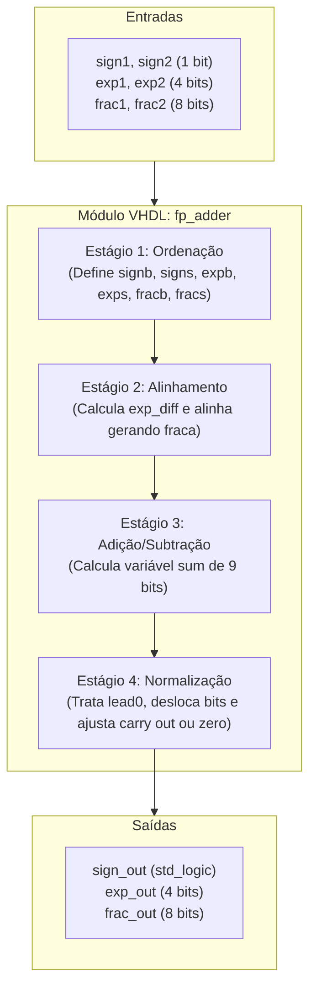
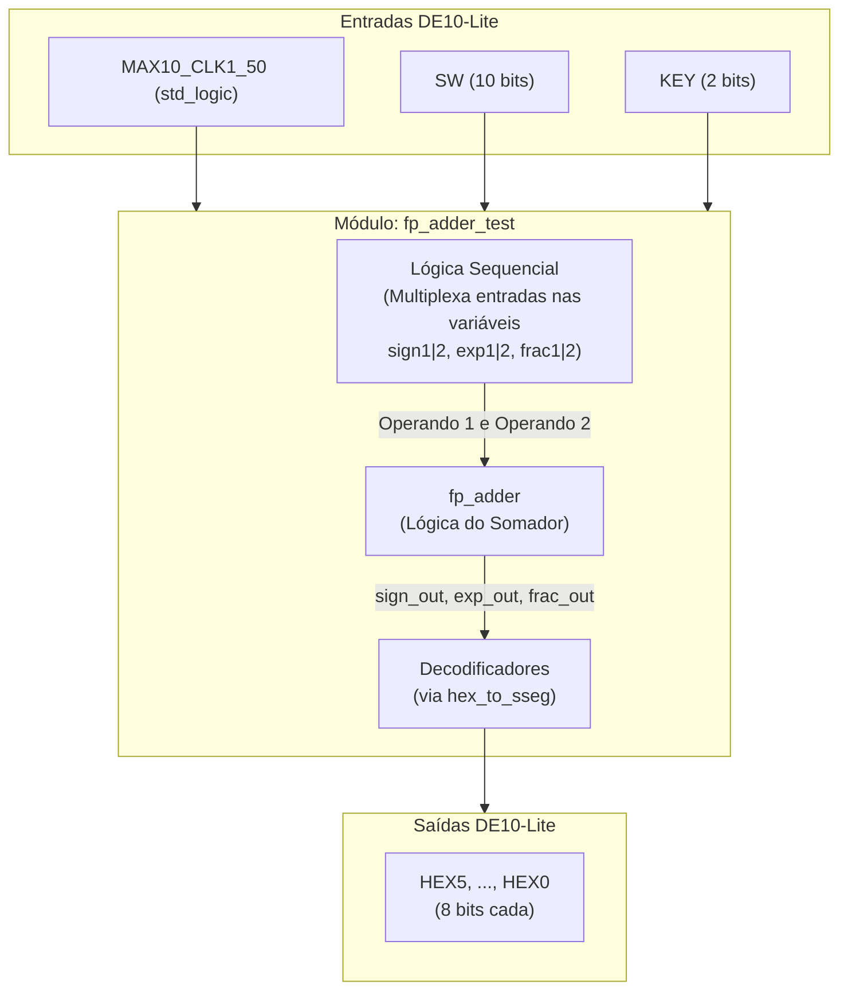

# Tutorial: Implementação de Somador Ponto Flutuante na DE10-Lite

**Autores:** Daniel Medici Martins, Gabriel Ângelo Sembenelli, 	Vinicius Higuchi

**Disciplina:** Sistemas Digitais Q2.20026

**Data:** 9 de Agosto de 2026

---

*Etapa 1*

## 1. Objetivo do Projeto

Este projeto adapta o somador de ponto flutuante simplificado (13 bits) do livro-texto para a placa Terasic DE10-Lite (MAX 10). O objetivo é demonstrar a síntese lógica e a simulação de hardware usando VHDL.

## 2. Descrição gráfica do funcionamento do sistema

A parte lógica do somador (`fp_adder.vhd`) recebe dois números em formato de ponto flutuante $(-1)^s \times 0.f \times 2^e$, onde $s$ corresponde ao sinal, $f$ corresponde à parte fracionária (ou significando) e $e$ corresponde ao expoente.
O funcionamento da soma é em 4 estágios:

* **1. Ordenação:** Identifica o maior (big) e o menor (small) número, desconsiderando o sinal.

* **2. Alinhamento:** Calcula a diferença entre os expoentes (`exp_diff = expb - exps`) e desloca o significando do menor número (`fracs`) para a direita, de modo a deixar os expoentes iguais.

* **3. Adição/Subtração:** Realiza a soma ou subtração dos significandos a depender dos sinais (soma quando iguais e subtrai caso contrário), originando a variável `sum` que inclui um bit extra para *carry-out*.

* **4. Normalização:** Conta a quantidade de zeros à esquerda do significando (`lead0`) e faz a normalização com condições especiais: Se houve carry out ($1.f \times 2^e$), então o número resultante é deslocado para a direita ($0.1f \times 2^(e+1)$); Se o número é pequeno demais para normalizar, então o resultado é definido como zero; Em condições normais, o significando é deslocado `lead0` casas para a esquerda e o expoente também é ajustado de acordo.

O resultado após a normalização é encaminhado para as saídas e o sinal resultante é o mesmo do maior número (big).

O diagrama ilustra esse fluxo e as respectivas variáveis VHDL da entidade:



*Etapa 2*

## 3. Adaptações de Hardware (DE10-Lite)

A arquitetura original utilizava 8 switches, 4 botões e 4 displays de sete segmentos. O respectivo código, em `code/old`, fixava o sinal (`0`) e expoente (`1000`) do primeiro número, além de fixar alguns bits de ambos significandos. Além disso, era utilizado um módulo de multiplexação no tempo (`disp_mux.vhd`) para exibir o resultado nos displays.

**O que mudamos no VHDL original:**

* Removemos o módulo `disp_mux.vhd`, pois a placa DE10-Lite permite exibição simultânea.
* Reorganizamos a lógica para entrar com os números usando uma lógica sequencial. A placa DE10-Lite possui 10 switches (`SW`) e 2 botões (`KEY`). Assim, o primeiro switch seleciona o sinal, os próximos 5 switches selecionam os 5 bits mais à esquerda do significando (os últimos 3 bits são fixados em zero) e os últimos 4 switches selecionam o expoente. Os dois botões se combinam para salvar a entrada atual como primeiro ou segundo número (um botão como seletor e um botão para salvar, enquanto um clock captura seus sinais).
* Roteamos as saídas do resultado diretamente para os 6 displays independentes da placa, `HEX5` a `HEX0`, sem multiplexação. `HEX5` para sinal, `HEX4` fixo em "0.", `HEX3` e `HEX2` para os 4 bits mais significativos e menos significativos da parte fracionária, respectivamente; `HEX1` fixo em "E", como abreviação de "vezes 2 elevado a"; `HEX0` para o expoente.
* Reorganizamos as strings correspondentes aos sete segmentos no arquivo `hex_to_sseg.vhd`, invertendo-as para compatibilidade com a DE10-Lite.

**Descrição gráfica do sistema**

O diagrama abaixo reflete a integração atual (`fp_adder_test`), evidenciando a multiplexação nas entradas e o roteamento direto para os displays:



## 4. Evidências de Validação

### Simulação 

Para investigar o 4º estágio (normalização) na simulação, consideramos as quatro situações possíveis:

* **Teste 1:** Soma sem casos especiais na normalização

Esse teste é uma soma comum e não cai em nenhum caso especial na normalização.

```txt
base 10 |         base 2           | base 16 (gtkwave)
  +64   |   +0.1000 0000 * 2^0111  | (s,f,e) = (0, 80, 7)
  +24   |   +0.1100 0000 * 2^0101  | (s,f,e) = (0, C0, 5)
========= Alinhando o menor número ======================
  +64   |   +0.1000 0000 * 2^0111  | 
  +24   |   +0.0011 0000 * 2^0111  | 
  ———   |   —————————————————————  | ————————————————————
= +88   | = +0.1011 0000 * 2^0111  | (s,f,e) = (0, B0, 7)
```

* **Teste 2:** Soma com carry out

Essa soma gera um carry out, ou seja, o número 1 à esquerda do ponto flutuante, sendo necessário um deslocamento à direita.

```txt
base 10 |         base 2           | base 16 (gtkwave)
   +8   |   +0.1000 0000 * 2^0100  | (s,f,e) = (0, 80, 4)
   +8   |   +0.1000 0000 * 2^0100  | (s,f,e) = (0, 80, 4)
  ———   |   —————————————————————  | 
= +16   | = +1.0000 0000 * 2^0100  | 
===== Deslocamento à direita na normalização ============
= +16   | = +0.1000 0000 * 2^0101  | (s,f,e) = (0, 80, 5)
```

* **Teste 3:** Subtração com deslocamento à esquerda

Esse cálculo gera 4 zeros à esquerda no resultado, sendo necessário um deslocamento à esquerda.

```txt
base 10 |         base 2           | base 16 (gtkwave)
  +17   |   +0.1000 1000 * 2^0101  | (s,f,e) = (0, 88, 5)
  -16   |   -0.1000 0000 * 2^0101  | (s,f,e) = (1, 80, 5)
  ———   |   —————————————————————  | 
=  +1   | = +0.0000 1000 * 2^0101  | 
===== Deslocamento à esquerda na normalização ===========
=  +1   | = +0.1000 0000 * 2^0001  | (s,f,e) = (0, 80, 1)
```

* **Teste 4:** Subtração com resultado pequeno demais é zerado na normalização

Esse caso dá um número pequeno demais, ou seja, um número em que a quantidade de zeros à esquerda (`lead0`) é maior que o valor do expoente. Neste projeto, como a representação do expoente não admite número negativo, o livro opta por zerar o resultado na normalização.

```txt
base 10 |         base 2           | base 16 (gtkwave)
 +15.25 |   +0.1111 0100 * 2^0100  | (s,f,e) = (0, F4, 4)
 -15.00 |   -0.1111 0000 * 2^0100  | (s,f,e) = (1, F0, 4)
  ————— |   —————————————————————  | 
= +0.25 | = +0.0000 0100 * 2^0100  | 
=== Normalização zera o resultado (lead0 > expoente) ====
=  0    | = +0.0000 0000 * 2^0000  | (s,f,e) = (0, 00, 0)
```

Além disso, foram observados dois casos que não foram definidos ou tratados no livro: o overflow do expoente e a representação do número zero.
Esses comportamentos são ilustrados nos testes abaixo:

* **Teste 5 (extra):** Adição com overflow no expoente

O livro não diz o que fazer quando o expoente excede a representação em 4 bits, abrindo espaço para este comportamento.

```txt
 base 10 |         base 2              | base 16 (gtkwave)
  +31744 |   +0.1111 1000 * 2^1111     | (s,f,e) = (0, F8, F)
   +1024 |   +0.1000 0000 * 2^1011     | (s,f,e) = (0, 80, B)
======== Alinhando o menor número ===========================
  +31744 |   +0.1111 1000 * 2^1111     | 
   +1024 |   +0.0000 1000 * 2^1111     | 
  —————— |   ———————————————————————   | 
= +32768 | = +1.0000 0000 * 2^1111     | 
======== Deslocamento à direita na normalização =============
= +32768 | = +0.1000 0000 * 2^(1111+1) | 
======== Overflow no expoente não tratado ===================
=   +0.5 | = +0.1000 0000 * 2^0000     | (s,f,e) = (0, 80, 0) 
```

* **Teste 6 (extra):** Zero com expoente

Na etapa de contar zeros à esquerda (`lead0`), o código só conta até 7 zeros, ou seja, não olha para o caso em que os 8 bits do significando são zero. Nesse caso, o código normaliza como se fossem 7 zeros à esquerda, no entanto, o significando continua zerado e com expoente não nulo. O livro diz que as representações precisam ser normalizadas ou zero, mas não diz se o zero deve ter um expoente específico, abrindo espaço para este comportamento.

```txt
base 2                   | base 10 | base 16 (gtkwave)
  +0.1111 0000 * 2^1111  |  +30720 | (s,f,e) = (0, F0, F)
  -0.1111 0000 * 2^1111  |  -30720 | (s,f,e) = (1, F0, F)
  —————————————————————  |  —————— | 
= -0.0000 0000 * 2^1111  |         | 
= -0.0000 0000 * 2^1000  | =     0 | (s,f,e) = (1, 00, 8)
```


### Código VHDL Final 

```vhdl
-- Insira aqui o VHDL final e faça ênfase nos trechos de código mais importantes da sua adaptação, isto é, eles devem estar claramente identificados.
```

*Etapa 3*

### Funcionamento na Placa

Abaixo, imagens do funcionamento na Placa para 4 casos.

*Etapa 4 (considerando qeu a Etapa 4 considera toda a documentação em si)*

## 5. Diário de Bordo de IA 

Utilizamos o [ChatGPT/Claude/Gemini] para auxiliar na geração do Testbench e na refatoração do código. Abaixo está a análise crítica do uso da ferramenta.

**Prompts Utilizados:**
> "Insira aqui o prompt exato que você usou..."

**O Erro da IA (Alucinação):**
> Descreva aqui o que a IA errou (ex: tentou usar pinos inexistentes, criou clock em testbench de circuito combinacional, etc).

**A Correção Humana:**
> Como você corrigiu o código gerado para que ele funcionasse na nossa placa e na simulação.

## 6. Contribuição dos participantes

Utilize a taxonomia CRediT, seguem exemplos:

* [Nome do Aluno 1], Administração do Projeto, Desenvolvimento, implementação e teste de software, Análise Formal
* [Nome do Aluno 2], Validação de dados e experimentos
* [Nome do Aluno 3], Redação do manuscrito original, Validação de dados e experimentos

[CRediT - Link1](https://credit.niso.org/)
[CRediT - Link2](https://revistas.unijui.edu.br/public/site/Taxonomia_CRediT.pdf)
